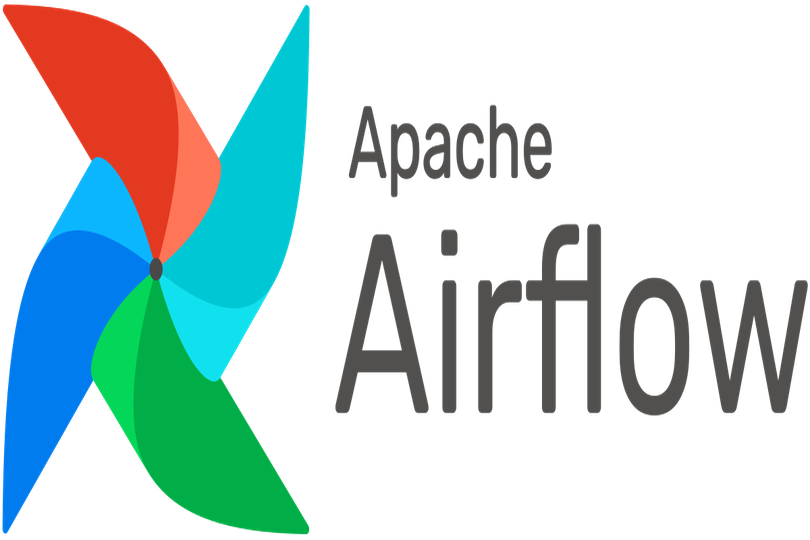

### Data Analyst 👨‍💻 | Data Engineer 🛠️ | Data Scientist 📊 | Kaggle Competitor 🏆 | AI Enthusiast 🤖
I'm a multi-faceted data professional specializing in Python Programming 🐍, SQL Database Management 🗃️, and Tableau Data Visualization 📊. Outside of my day-to-day work, I'm an active Kaggle competitor and an AI research enthusiast.

🏗 I’m Currently Working On
- Looking for a job. 
- Kaggle Competitions: Sharpening my data science skills through real-world challenges
- Building interesting AI applications using Llama2, CodeLlama, OpenAI, and on

🌱 I’m Currently Learning:
- AWS: Actively pursuing certification to strengthen my cloud computing skills
- AI Agent Development: Exploring applications of AI agents in data analytics

👯 I’m Looking To Collaborate On
- Open-source Python Projects: Particularly those focused on data analytics, machine learning, and AI
- Kaggle Competitions: Especially in the areas of Natural Language Processing (NLP) and Computer Vision

🛠️ Languages and Tools:
- Python, Flask, Django, PostgreSQL, MongoDB, Tableau, PowerBI, Apache Airflow, Apache Spark, AWS, Sci-KitLearn, Tensorflow 

<!DOCTYPE html>
<html lang="en">
<head>
  <meta charset="UTF-8">
  <title>Images in a Row</title>
  
</head>
<body>

  

    
    
    
    
    
    
    
    
    
    
  

</body>
</html>

 icons by <a target="_blank" href="https://icons8.com">Icons8</a>

